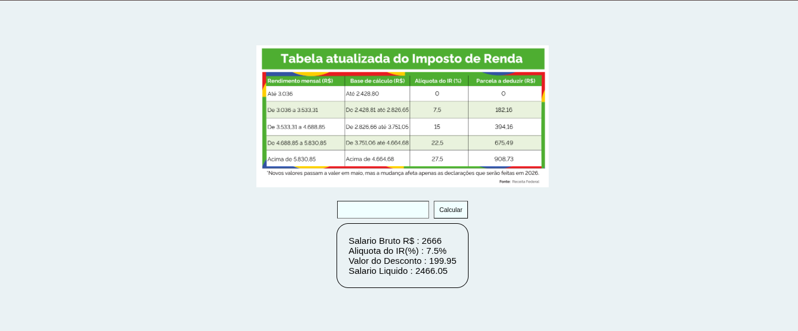
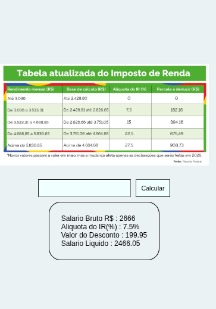
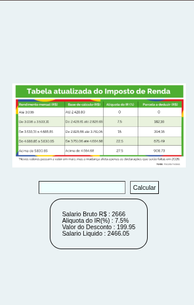

## Atividade Folha de Pagamento

### Screenshots

 

 

### proposta de Atividade

Atividade Folha de Pagamento

Instruções

__Habilidades__: Codificar software em linguagem para web. 

__Valores e Atitudes__: Incentivar a criatividade. Estimular o interesse na resolução de situações-problema. Responsabilizar-se pela produção, utilização e divulgação de informações. 

__Atribuições e Responsabilidades__: Planejar projetos de sistemas de informação para web.

Obs.: A atividade deverá ser feita em sala de aula. 

Os projetos criados pelo aluno deverá estar organizado no GitHub, isso fará com que tenha um portfólio. 

### Stack Utilizada
- PHP
- HTML
- CSS
